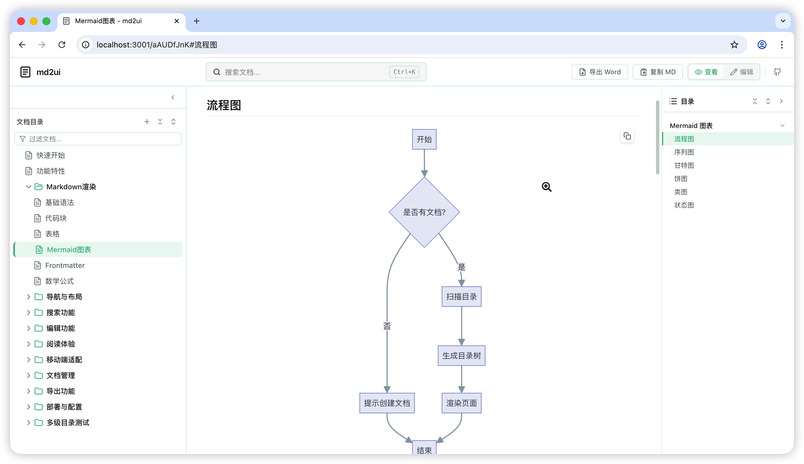
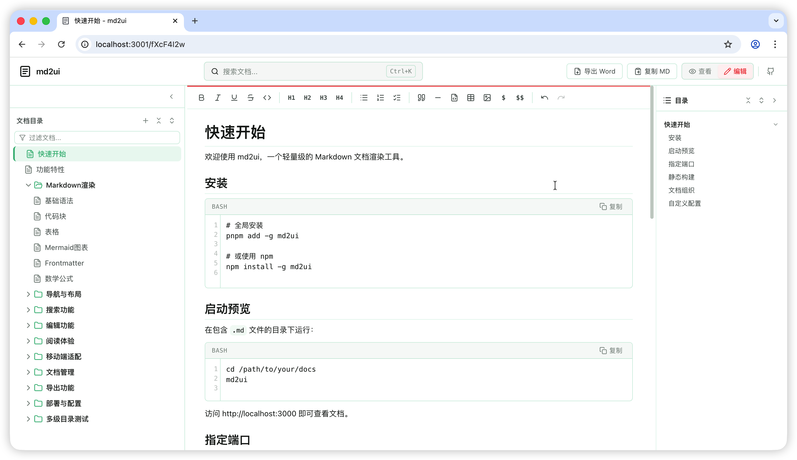

# md2ui

[](https://www.npmjs.com/package/md2ui)
[](https://github.com/xiaoyaodev/md2ui)
[](LICENSE)

轻量级 Markdown 文档站点工具，一行命令将本地 `.md` 文件转换为可预览、可编辑、可搜索的文档站点。

## 为什么需要 md2ui？

AI 编程时代，Cursor、Copilot、Kiro 等工具正在改变我们的开发方式。与 AI 协作的过程中，会产生大量的 Markdown 文档 —— 需求文档、设计方案、API 文档、会议纪要、技术调研……

这些 `.md` 文件散落在项目各处，带来了一系列痛点：

- 文件越来越多，找一篇文档要翻半天
- IDE 的 Markdown 预览体验一般，表格、流程图、数学公式渲染不理想
- 想快速改几个字，还得切回编辑器找到对应文件
- 文档之间缺乏导航关系，无法形成知识体系
- 想分享给团队成员，还得额外搭建文档站

md2ui 就是为了解决这些问题而生的。把它指向你的文档目录，立刻获得一个功能完整的文档站点。

## 核心能力

- 零配置启动 - `cd docs && md2ui`，开箱即用
- 实时预览 - 文件变更自动刷新，所见即所得
- 在线编辑 - 内置富文本编辑器，直接在浏览器中修改并保存到本地文件
- 全文搜索 - 基于 MiniSearch，毫秒级检索所有文档内容
- 自动导航 - 扫描目录结构自动生成多级目录树，支持拖拽排序
- 三栏布局 - 左侧导航 / 中间内容 / 右侧大纲，宽度可拖拽调整
- Markdown 增强 - GFM 语法、代码高亮、Mermaid 图表、数学公式、Frontmatter
- 移动端适配 - 响应式布局，手机上也能舒适阅读
- 阅读体验 - 进度条、预计阅读时间、上下篇导航、图片放大
- SSG 构建 - `md2ui build` 生成纯静态站点，可直接部署
- 自定义配置 - 站点标题、主题色、GitHub 链接、页脚等

## 界面预览
预览模式

编辑模式



## 典型使用场景

**AI 辅助开发的文档管理**

用 AI 生成的需求文档、设计方案、技术调研统一放到一个目录，md2ui 提供即时预览和编辑，让文档真正流动起来。

**个人知识库**

日常笔记、学习记录、读书摘要，用 Markdown 写完丢进文件夹，md2ui 自动组织成可浏览的知识站点。

**项目文档站**

API 文档、部署指南、开发规范，`md2ui build` 一键构建为静态站点，部署到任意服务器。

**团队协作文档**

配合 Git 管理文档版本，本地用 md2ui 预览和编辑，提交后自动构建部署。

## 快速开始

### 安装

```bash
# 需要提前安装nodejs运行环境
npm install -g md2ui


# 免安装 一次性运行
npx  md2ui
```

### 实时预览

在包含 `.md` 文件的目录下运行：

```bash
cd /path/to/your/docs
md2ui
```

访问 http://localhost:3000 即可查看文档。支持 `-p` 参数指定端口：

```bash
md2ui -p 8080
```

### 静态构建

```bash
md2ui build
```

生成的静态文件在 `dist/` 目录下，可直接部署到 Nginx、GitHub Pages、Vercel 等任意静态托管服务。

## 文档组织

```
your-docs/
├── README.md              # 首页内容
├── 00-快速开始.md
├── 01-功能特性.md
└── 02-进阶指南/
    ├── 01-目录结构.md
    └── 02-自定义配置.md
```

- 使用 `序号-名称.md` 格式控制排序，如 `01-快速开始.md`
- 文件夹同样支持序号前缀，如 `02-进阶指南/`
- 支持任意层级嵌套

## 自定义配置

在文档目录下创建 `md2ui.config.js` 或 `.md2uirc.json`：

```js
// md2ui.config.js
export default {
  title: '我的文档站',
  port: 8080,
  folderExpanded: true,
  themeColor: '#3eaf7c',
  github: 'https://github.com/your/repo',
  footer: 'Copyright © 2025'
}
```

| 配置项 | 类型 | 默认值 | 说明 |
|--------|------|--------|------|
| title | string | `'md2ui'` | 站点标题 |
| port | number | `3000` | 开发服务器端口 |
| folderExpanded | boolean | `false` | 文件夹默认展开 |
| themeColor | string | `'#3eaf7c'` | 主题色 |
| github | string | `''` | GitHub 仓库链接 |
| footer | string | `''` | 页脚内容 |

## 开发

```bash
git clone https://github.com/xiaoyaodev/md2ui.git
cd md2ui
pnpm install
pnpm dev
```

### 项目结构

```
md2ui/
├── bin/
│   ├── md2ui.js           # CLI 入口（dev server）
│   └── build.js           # SSG 静态构建
├── src/
│   ├── App.vue            # 主组件
│   ├── components/        # Vue 组件
│   ├── composables/       # 组合式函数
│   ├── extensions/        # Tiptap 编辑器扩展
│   ├── services/          # 文档服务
│   ├── config.js          # 共享配置
│   └── style.css          # 全局样式
├── public/docs/           # 示例文档
└── vite.config.js         # Vite 配置
```

### 发布新版本

参考 [发布文档](docs/发布到%20npm%20仓库.md)

## 许可证

MIT License
