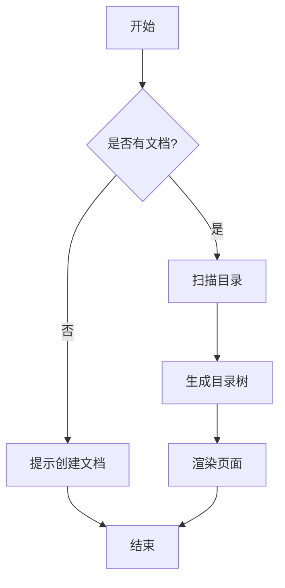
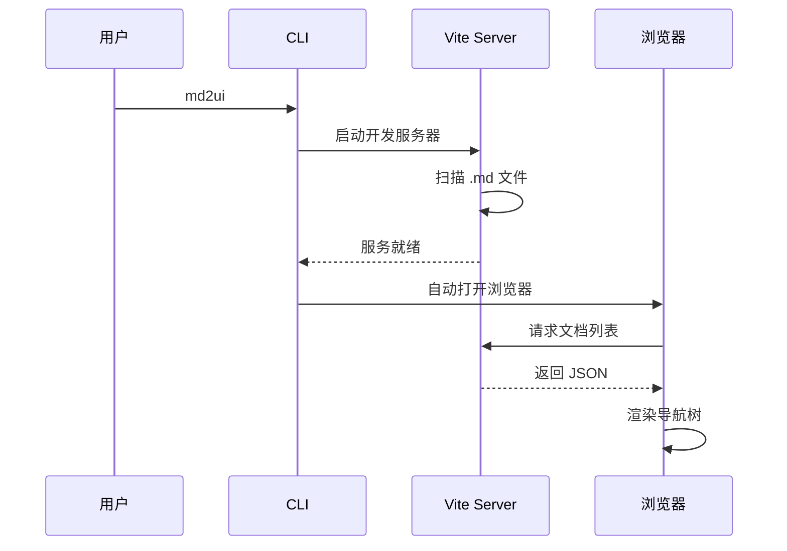
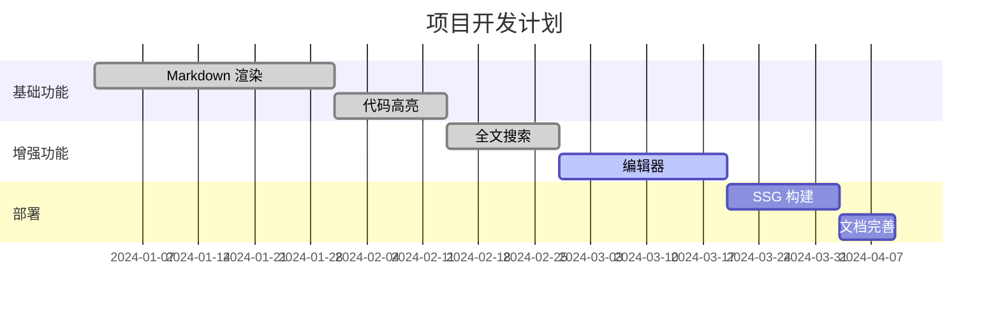
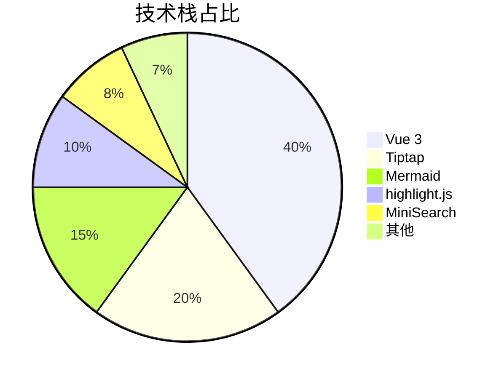
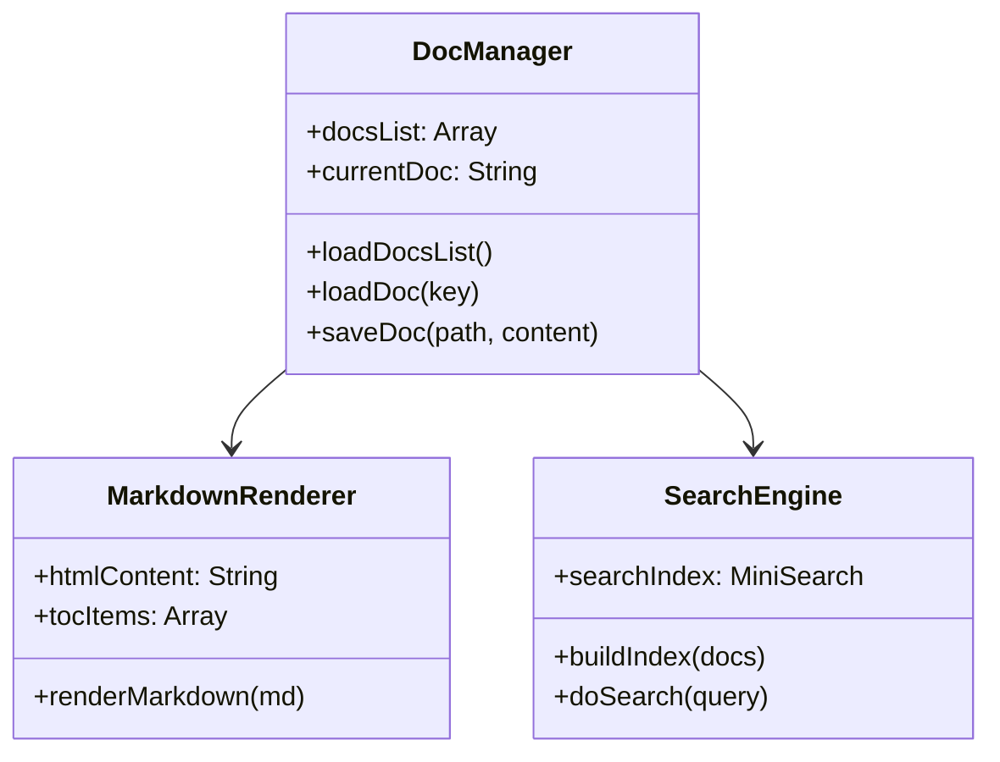
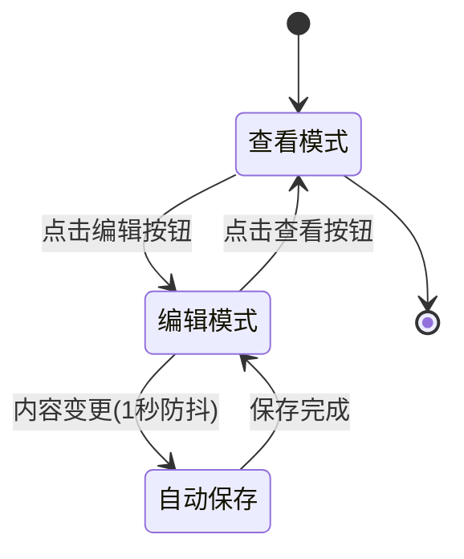

# Mermaid 图表

验证各类 Mermaid 图表的渲染效果。图表支持点击放大查看。

## 流程图

```mermaid
graph TD
    A[开始] --> B{是否有文档?}
    B -->|是| C[扫描目录]
    B -->|否| D[提示创建文档]
    C --> E[生成目录树]
    E --> F[渲染页面]
    D --> G[结束]
    F --> G
```

## 序列图

```mermaid
sequenceDiagram
    participant U as 用户
    participant C as CLI
    participant V as Vite Server
    participant B as 浏览器

    U->>C: md2ui
    C->>V: 启动开发服务器
    V->>V: 扫描 .md 文件
    V-->>C: 服务就绪
    C->>B: 自动打开浏览器
    B->>V: 请求文档列表
    V-->>B: 返回 JSON
    B->>B: 渲染导航树
```

## 甘特图

```mermaid
gantt
    title 项目开发计划
    dateFormat  YYYY-MM-DD
    section 基础功能
    Markdown 渲染     :done, a1, 2024-01-01, 30d
    代码高亮          :done, a2, after a1, 14d
    section 增强功能
    全文搜索          :done, b1, after a2, 14d
    编辑器            :active, b2, after b1, 21d
    section 部署
    SSG 构建          :c1, after b2, 14d
    文档完善          :c2, after c1, 7d
```

## 饼图

```mermaid
pie title 技术栈占比
    "Vue 3" : 40
    "Tiptap" : 20
    "Mermaid" : 15
    "highlight.js" : 10
    "MiniSearch" : 8
    "其他" : 7
```

## 类图

```mermaid
classDiagram
    class DocManager {
        +docsList: Array
        +currentDoc: String
        +loadDocsList()
        +loadDoc(key)
        +saveDoc(path, content)
    }
    class MarkdownRenderer {
        +htmlContent: String
        +tocItems: Array
        +renderMarkdown(md)
    }
    class SearchEngine {
        +searchIndex: MiniSearch
        +buildIndex(docs)
        +doSearch(query)
    }
    DocManager --> MarkdownRenderer
    DocManager --> SearchEngine
```

## 状态图

```mermaid
stateDiagram-v2
    [*] --> 查看模式
    查看模式 --> 编辑模式: 点击编辑按钮
    编辑模式 --> 查看模式: 点击查看按钮
    编辑模式 --> 自动保存: 内容变更(1秒防抖)
    自动保存 --> 编辑模式: 保存完成
    查看模式 --> [*]
```