# Mermaid 超复杂图表压力测试

本文档用于测试 Mermaid 在极端复杂场景下的渲染能力，包含大规模节点、深层嵌套、复杂交互关系等场景。

\## 1. 大规模微服务架构流程图

模拟一个包含 30+ 节点的电商微服务架构全链路调用关系。

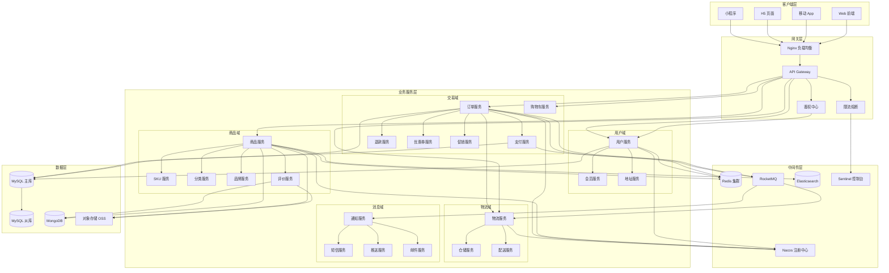

## 2. 超长序列图 - 电商下单全链路

模拟从用户点击下单到收货完成的完整时序交互，涉及 12 个参与者。

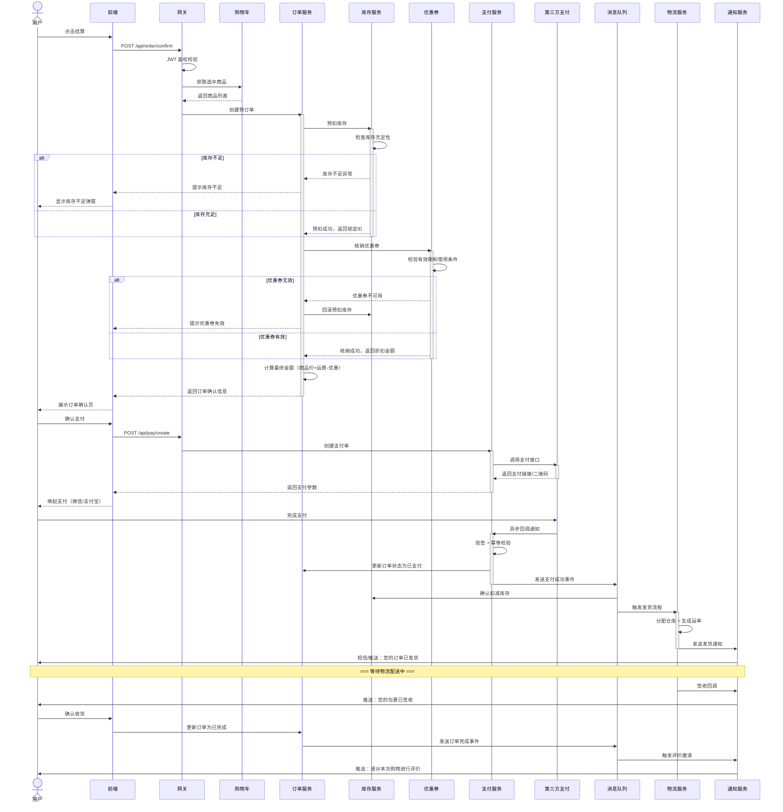

## 3. 复杂状态机 - 订单生命周期

包含多层嵌套状态、并行状态和历史状态的完整订单状态机。

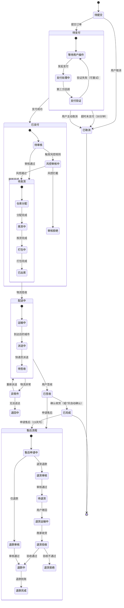

## 4. 大规模类图 - 领域模型

模拟电商核心领域的完整类关系图，包含继承、组合、聚合、依赖等多种关系。

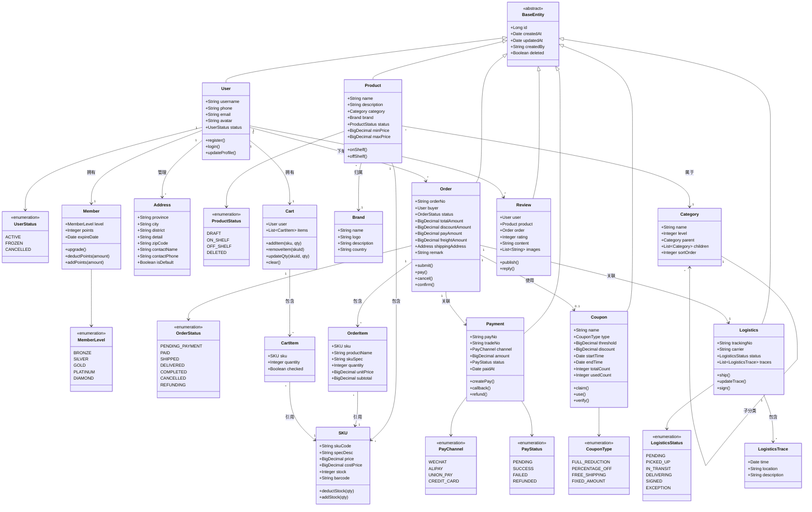

## 5. 复杂甘特图 - 大型项目排期

模拟一个跨 6 个月、多团队并行的大型项目排期。

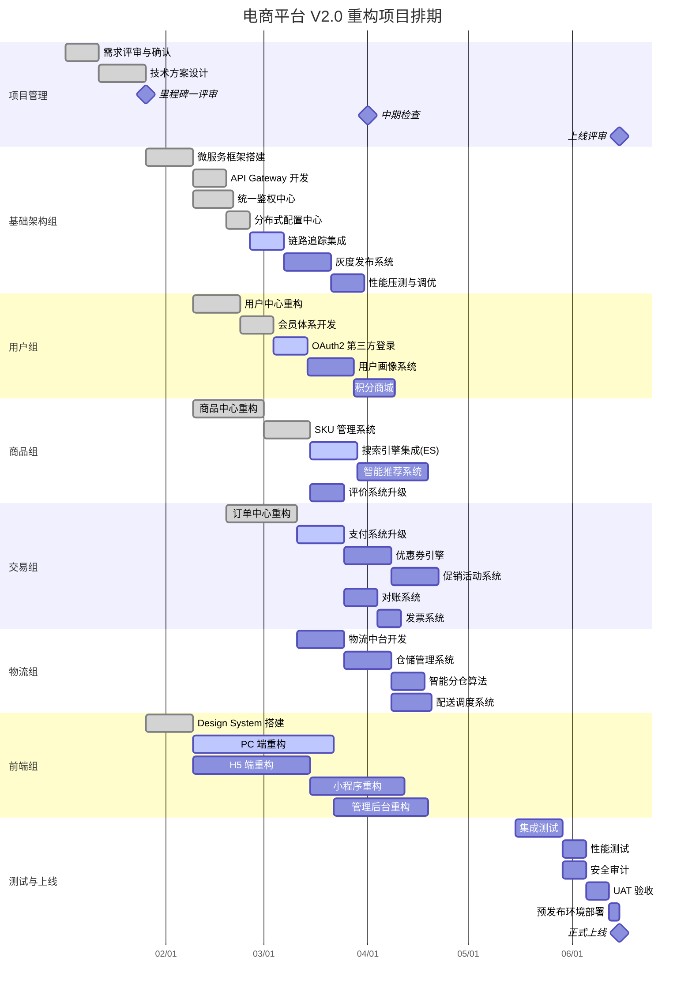

## 6. 复杂 ER 图 - 数据库设计

模拟电商核心数据库的实体关系图。

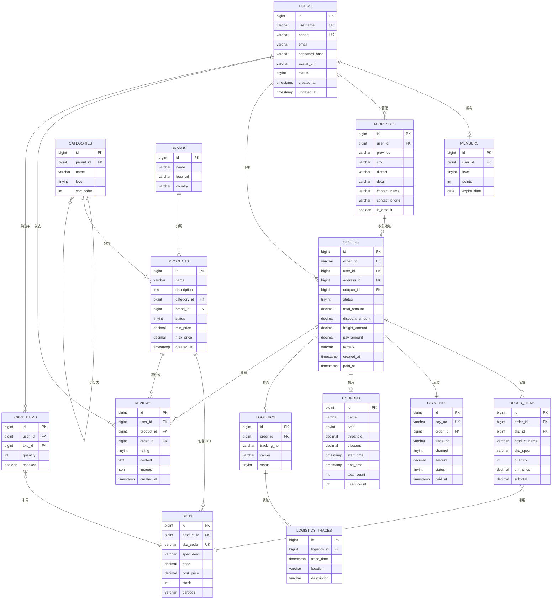

## 7. 复杂流程图 - CI/CD 全流程

模拟一个包含多分支、条件判断、并行任务的 CI/CD 流水线。

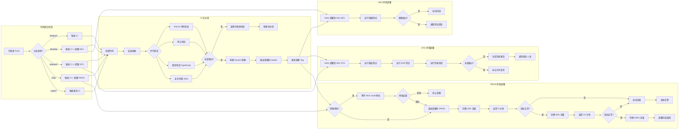

## 8. 用户旅程图 - 电商购物体验

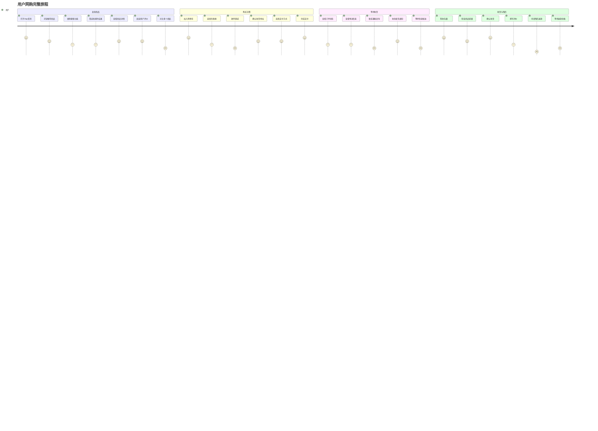

## 9. Git 分支管理图

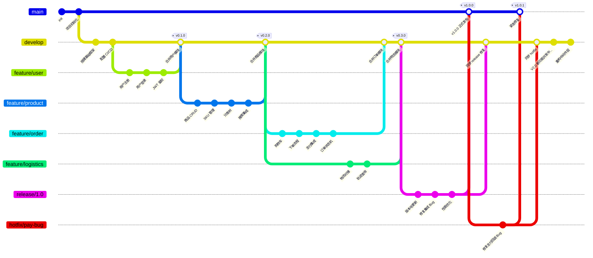

## 10. 复杂思维导图 - 技术选型

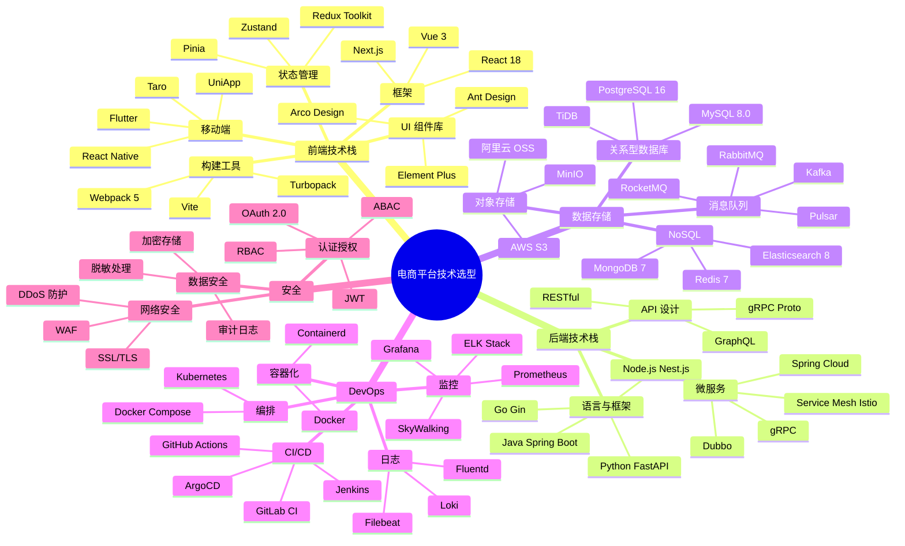

## 11. 超复杂序列图 - 分布式事务 Saga 模式

模拟一个涉及 8 个服务的 Saga 分布式事务编排，包含正向操作和补偿回滚。

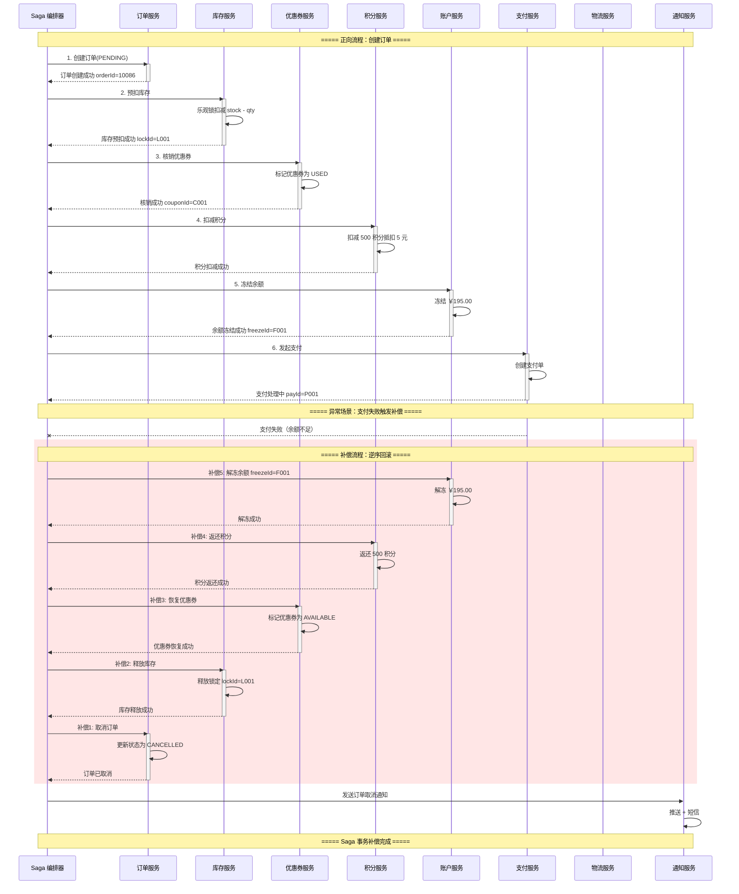

## 12. 超大饼图与象限图

### 技术债务分布

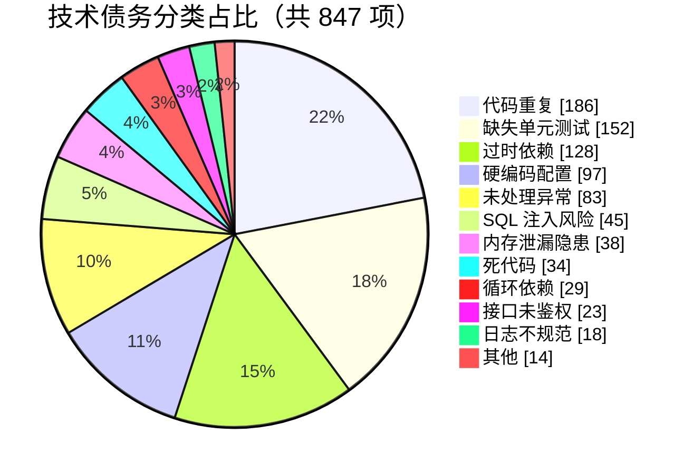

### 技术评估象限图

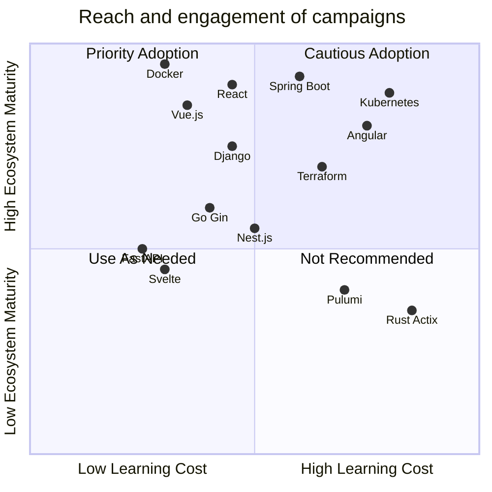

## 13. 时间线图 - 项目里程碑

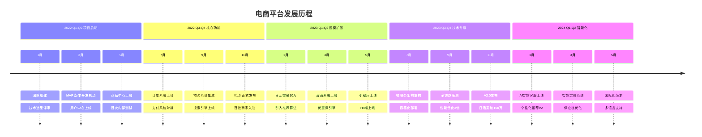

## 14. 超复杂流程图 - 风控决策引擎

模拟一个多层嵌套、大量条件分支的实时风控决策流程。

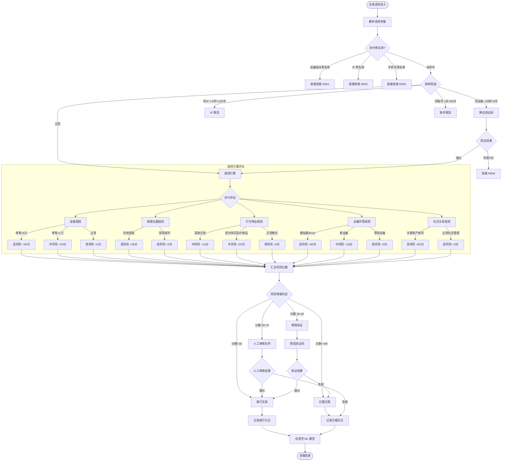

## 15. 复杂饼图组合 - 系统监控仪表盘数据

### 服务器资源使用分布

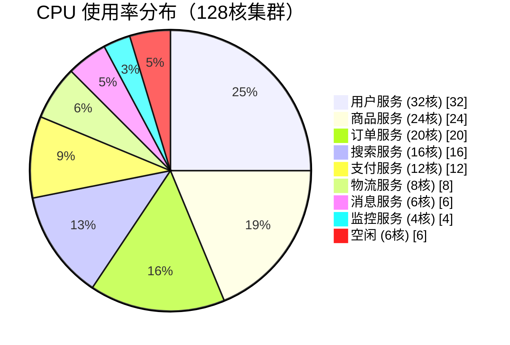

### 错误类型分布

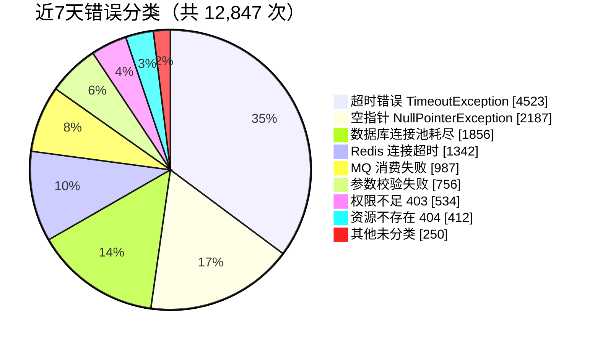

---

> 本文档包含 15 种不同类型的超复杂 Mermaid 图表，涵盖流程图、序列图、状态图、类图、ER 图、甘特图、饼图、思维导图、Git 图、用户旅程图、象限图、时间线图等，用于全面测试 Mermaid 渲染引擎在极端复杂场景下的表现。