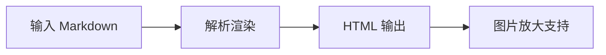

# 图片放大

验证图片点击放大和多图切换功能。

## 图片展示

以下图片应支持点击放大查看：

\## 放大功能

- 点击图片弹出放大浮层
- 放大浮层显示图片原始尺寸
- 点击浮层背景或按 ESC 关闭

## 多图切换

当文档中有多张图片时：

- 放大浮层支持左右切换图片
- 显示当前图片索引

## Mermaid 图表放大

Mermaid 渲染后的图表也支持点击放大：

## 验证要点

1. 点击上方 Vue Logo 图片，应弹出放大浮层
2. 放大浮层中图片应清晰显示
3. 点击背景或按 ESC 应关闭浮层
4. 点击 Mermaid 图表也应支持放大

   